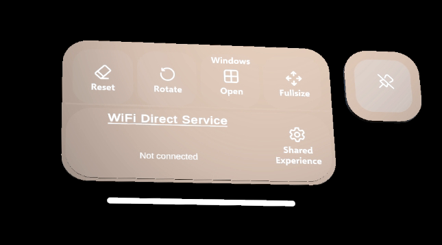
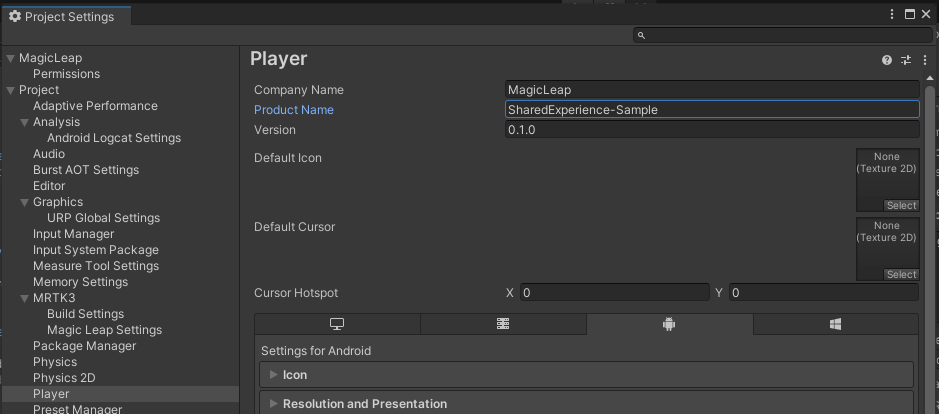

# WiFi-Direct-Shared-Experience-Sample App

<table  cellspacing="0" cellpadding="0" border="0">
<tr>
<td valign=top width="25%">
 
</td>
<td valign=top>	
Shared Experience sample app that uses WiFi Direct Service Discovery Android Native Unity Plug-in
  
This Unity C# project leverages the sample Android-Unity WiFi Direct Service Discovery Plug-in to demonstrate a basic low friction peer-to-peer multi-device shared experience between Magic Leap 2 devices without the need for external network infrastructure.
  
The sample allows anywhere from 2 to 11 users, each wearing a Magic Leap 2 headset, to quickly join and share in a common AR experience where they all see, and manipulate, a virtual 3D model, of a concept car, that appears to be in the same physical location as users move and manipulate it about their local shared space.
</td>
</tr>
</table>

## Getting started

This project leverages Unity 2022.3.6f1 and MRTK3.

After cloning this project to your local machine you should be able to open, set the build target to Android,

<table  cellspacing="0" cellpadding="0" border="0">
<tr>
<td valign=top width="25%" rowspan="2">
 
</td>
<td valign=top>	

and include the `Assets|Scenes|SampleScene` in your build, then deploy the application to your ML2 devices. Alternatively, you can just sideload the included build of the sample application [APK](/Builds/SharedExperienceSample.apk) through MLHub to your device(s) to try the sample experience, before diving into the code.

</td>
</tr>
<tr border="0">
<td valign=bottom>

>📝NOTE: Please check out our Developer Portal for more details on Getting Started with [Unity projects](https://developer-docs.magicleap.cloud/docs/guides/unity/getting-started/unity-getting-started/) for Magic Leap 2, and [MRTK3](https://developer-docs.magicleap.cloud/docs/guides/third-party/mrtk3/mrtk3-new-project/) if needed for more details about setup, building and deploying to Magic Leap 2.

</td>
</tr>
</table>

## Walk through of the sample shared experience.

After launching the application a 3D model of a concept car will appear rotating above a circular stage.

 A near menu will appear within the reach of the user, the upper half displays a number of buttons to perform the basic indirect interactions available to control the 3D car model. The lower portion of the menu contains a `Shared Experience` button that toggles the display of the WiFi Direct control window.

### Establishing a common origin
The circular stage has been designed as a simple way to estatablish a main reference point, or origin in this AR experience. 

Each participant should select, move, and orient the stage in their application to an agreed point in their physical space.

By moving the stage to an agreed upon location in the shared physical world, such as a corner of a table, and rotating the stage so that the green indicator points to an agreed particular wall, or location in the local physical space, this sample demonstrates one way to create a common origin between all devices so that the central 3D objects, like the car in this sample, can be rendered into the real world and appear at the same physical location and orientation as seen from each of the devices in the shared experience. 

Other options for establishing a common shared origin, such as having each device scan a staticly placed printed Aruco marker into the physical scene, are not demostrated in this sample but are left as potential experiments or explorations to extend or enhance this sample.

### Connecting peer-to-peer over WiFi Direct

The WiFi Direct control window provides the option to either:

`Host Service` - Establish and broadcast a WiFi Direct Service for other devices to discover and connect to.

or to

`Discover` - Search for available and compatible WiFi Direct services in the local area.

Any one of the devices, running the sample application, that are going to participate in a shared experience can act as the service session host. To start a shared session, one user first needs to press the `Host Service` button on their device, then the other users can click the `Discover` button on their devices, and the host service should appear in the list of available services shortly there after. 

>📝Note: It can sometimes take a few minutes for the service to appear depending on a number of factors, including the previous state and activity of the devices being used.

<table  cellspacing="0" cellpadding="0" border="0">
<tr> 
<td valign=top width=50% cellpadding=0 cellspacing=0>

</td>
<td valign=top width=50% cellpadding=0>

</td>
</tr>
</table>

Clicking on the service in the list of available services (from the device doing `Discovery`) will initiate a connection. Like Discovery, connecting can also be almost instant, or take a minute or two, depending on the previous state of the devices. 

The session host will initially receive, and need to confirm, an `Invitation to connect` to authorize that the peer is trusted, prior to the connection being established. 

>📝Note: After the first time connecting, the authorization gets cached, but occassionally may appear on future connection attempts depending on elapsed time, and device state.

The host device will list each peer that is connected under the `Host Service` button with a connection icon to the right. 

The peer will show the connected icon on the right end of the associated Discovered service button.

The near menu on both devices should update the WiFi Direct Service section with the appropriate connection information, and highlight the section in green to indicate an active connection.

<table  cellspacing="0" cellpadding="0" border="0">
<tr> 
<td valign=top width=50% cellpadding=0 cellspacing=0>

</td>
<td valign=top width=50% cellpadding=0>

</td>
</tr>
</table>

## Using this sample project as a staring point for a new project.

Something as simple as deleting the `ConceptCar` model, importing a new 3D model into the project, and placing it under the `3DModel` gameobject in the scene `Hierachy` can be an easy, and quick way to generate a new, and different Shared Experience. Adjust the postion of your new model on the presentation stage, and fit the box colider on the `3DModel` to the new shape.  If your new 3D model consists of a number of distinct parts, you could drag and drop certain parts into the `Model Controller`'s `Hideable Parts List`, and adjust the text and symbol displayed for the `Action Button Windows` or just remove or change the functionality of the button accordingly, and continue to customize, or modify the experience as you see fit.

When using this sample project as a form of template, or as a starting point to create a new shared experience project, it is recommended that after cloning, or copying the initial project files to a local machine, and before starting to edit/change the project, to first change the application name in the Project Settings:

`Edit|Project Settings...|Player|Product Name`

 

and it helps to adjust the Package Name of the project to be different, and unique to avoid conflictly with applications with the same package name.

`Edit|Project Settings...|Player|Other|Identification|Package Name`

 

This sample uses the Application.productName string as the Wi-Fi Direct Service name that will get broadcast, and discovered by the application. Having a unique package name, and service name for each new shared experience application will help avoid issues with different projects trying to install overtop of each other, as well as unintended compatibility issues that could occur with users of different shared experience applications making inadvertent, or unsupported connections between unrelated applications due to them having the same service name. 

>📝Note: It is also possible to adjust the `SetServiceName` call, and pass something other than `Application.productName` in order to create a new, and appropriate Wi-Fi Direct Service name for a new application.  

## The objects in the sample shared experience.

### 3DModel

This is the main virtual content that is the focus of this sample shared experience. The attached `Object Manipulator` and `Bounds Control` components provide a simple way for the user to interact with and manipulate the `3DModel`.

### PresentationStage 

This virtual stage serves as a location that the virtual `3DModel` is presented on top of, or in relationship to. The location of the stage also serves as a common origin between devices during connected experiences. 

If each user initially moves, and aligns the stage to an agreed upon common location in the real world (for example the corner of an actual particular table top that happens to be in the physical surroundings) that will result in all users in the shared experience seeing the virtual 3DModel located at, and or moving through, the same location in the physical space that they share.

### NearMenuBase 

Not a shared element of this sample experience, a `NearMenuBase` virtual UI element will follow the user as they move about, and can be dragged by the drag bar to pin it to a convenient location. Serving as the main menu for the experience, it consists of two fundamental rows. 
* The first row contains four buttons that trigger indirect interactions with the `3DModel` to `Reset` position and orientation, toggle on/off model `Rotation`, toggle on/off elements (`Windows Open`) of the 3DModel, and trigger the 3DModel to scale to its `Fullsize`.
* The second row displays summary WiFi Direct Service details, and contains a button to toggle on/off `Shared Experience` `WiFiDirectMenu` for establishing WiFi Direct connections with other devices that are running this same sample application in your local area. 

Although each user will see their own independant view of their own virtual `NearMenuBase` menu, the state of toggle buttons on the first row (and only those indirect interaction buttons) will get updated during a shared experience based on the other user's interactions with the same buttons on their own menus.

### WiFiDirectMenu

Another virtual UI element that is not shared in this sample experience is the `WiFiDirectMenu`. It can be toggled on/off from the right hand side of the second row of the `NearMenuBase`.
This virtual WiFi Direct window displays the device name identity that will be shared with other peers beside the window heading.

The `Host Service` section provides a way to establish and brodcast a WiFi Direct Service that other devices can discover and connect to. Typically only one of the users a shared experience would volunteer or be designated to host a service. As other devices sucessfully connect to the service, their device names will appear in the list in the Host Service portion of the window.

The remaining participants involved in the shared experience would wait and then use their `Discover` button, after the designated host has started their service, to discover that service. It can take a moment or two, but once the service is discovered, it will appear on a button with the name of the service displayed on it in a list in the Discover portion of the window, and clicking the button will initiate a connection request with the the host service. After the host accepts the invite to connect, and the connection is established a small icon indicating the connection will appear on the button.

### WifiDirectPluginManager
Unlike the previously listed objects in the scene hierachy that display some form of visual virtual content to the user, manager objects like the `WifiDirectPluginManager` mostly act as a container for a script component that manages some aspect of application logic in the scene. In this case, this manager, contains the `WifiDirectPluginScript.cs` component mentioned below.

### SharedExperienceManager
Similar to the manager component mentioned above, the `SharedExperienceManager` does not display any visual virtual content to the user and is a simple container for the `SharedExperienceScript.cs` components described below.

## The scripts in the sample shared experience.

### ModelController.cs
Attached as a component of the `3DModel` object. 
This component impliments the button based, indirect interaction, functionality to `Reset`, `Rotate`, make `Fullsize` and to show/hide the togglable 3D model elements (`Windows Open`). The associated buttons on the `NearMenuBase` trigger methods from this script.

### SharedExperienceScript.cs
Attached as a component of the `SharedExperienceManager` object. 
This component manages the sharing and processing of user interactions with and from other connected devices and connects to the `NearMenuBase` and the main `3DModel` in the user interface to monitor and invoke shared interactions. Communication of this shared information to, and from, other devices is handled via the referenced `WiFiDirectPluginManager`. All shared positional information is calculated as relative to the `Stage`, which acts as a common world origin.

### WifiDirectPluginScript.cs
Attached as a component of the `WifiDirectPluginManager` object. 
This component manages communication with the WiFi Direct Plugin and connects to the `WiFiDirectMenu` and WiFi Direct Service portion of the `NearMenuBase` in the user interface to display information to the user, and to respond to user input.

## Forums
If you have questions that are not covered here, please check the Magic Leap  2 Developer Forum: https://forum.magicleap.cloud/

## Credits
This sample application contains the 3D model [ConceptCar 051](https://sketchfab.com/3d-models/free-conceptcar-051-public-domain-cc0-b1dd9c762c5a4d1c8441525d808125eb) by [Unity Fan](https://sketchfab.com/unityfan777) licensed under [CC BY 4.0](https://creativecommons.org/licenses/by/4.0/) 

# Copyright
Copyright (c) (2023) Magic Leap, Inc. All Rights Reserved. Use of this file is governed by the Developer Agreement, located here: https://www.magicleap.com/software-license-agreement-ml2 
